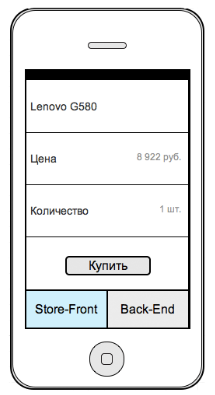
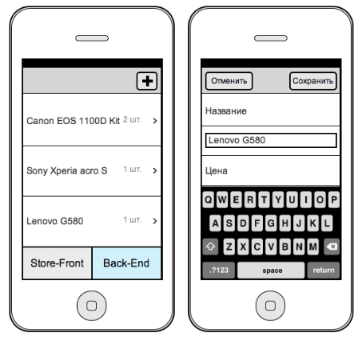

# Funbox

Task 1. 

Необходимо создать легковесное приложение для e-commerce решения. Приложение должно состоять из двух частей располагающихся на разных экранах:  

• store-front — клиент, где осуществляются просмотр и покупка товаров. 
• back-end — административная часть, позволяющая добавлять новые товары или редактировать существующие. 

. 
Store-front предоставляет возможности просмотра полной информации об одной товарной позиции и перехода к следующей или предыдущей позиции. Товар отображается только в том случае если его количество больше нуля. Переход от одного товара к другому происходит с анимированным сдвигом экрана влево/вправо при горизонтальном «перелистывании».  

. 
Back-end предоставляет возможности просмотра, редактирования и добавления продуктов.
В любой момент пользователь может переходить от одного экрана к другому.
